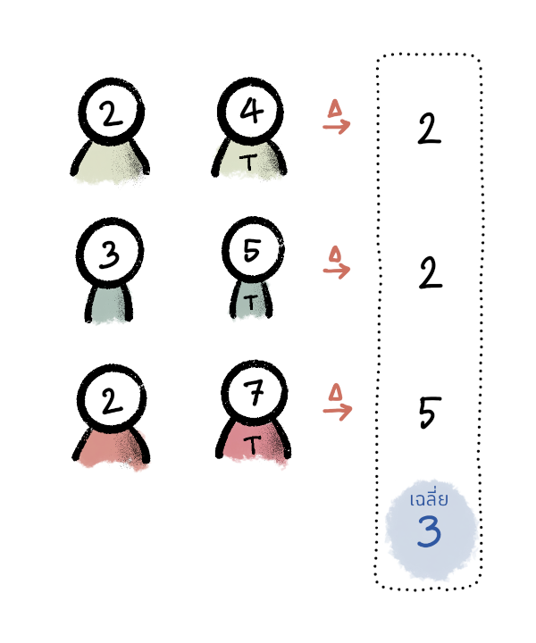
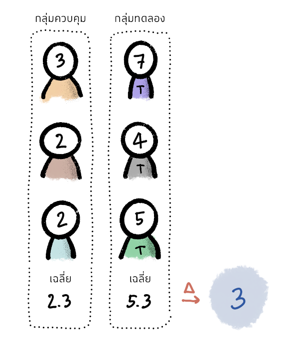

import MurderRate from "./MurderRate.js"
import Diff from "./Diff.js"

:::excerpt
ในปีนี้ คณะกรรมการรางวัลโนเบลสาขาเศรษฐศาสตร์ของสวีเดน
  มีมติให้มอบรางวัลประจำปี 2021 ครึ่งหนึ่งแก่ David Card (UC Berkeley)
  และอีกครึ่งหน่ึงแก่ Joshua Angrist (MIT) และ Guido Imbens (Stanford)
โดยทั้งสามมีส่วนช่วยผลักดันให้เศรษฐศาสตร์มีความน่าเชื่อถือมากยิ่งขึ้นผ่าน
  “การทดลองตามธรรมชาติ” (natural experiments)
บทความนี้จะพาท่านไปรู้จักกับหลักการของการทดลองทางวิทยาศาสตร์
  และนำเสนอว่าการทดลองตามธรรมชาตินี้คืออะไร
  เหตุใดการทดลองตามธรรมชาตินี้จึงเป็นหัวใจของงานวิจัยด้านเศรษฐศาสตร์ที่สำคัญหลายชิ้น
  รวมไปถึงเทคนิคต่าง ๆ ที่นักวิจัยคิดค้นและนำมาใช้เพื่อหาคำตอบสำหรับคำถามที่พวกเขาสนใจได้
:::

**กินกาแฟทุกเช้ามีผลดีต่อสุขภาพมั้ย? ถ้าเรียนต่ออีกปีนึงจะได้เงินเดือนเพิ่มซักเท่าไหร่? ยาตัวนี้ใช้รักษาโรคได้จริงหรือไม่? โครงการรัฐบาลช่วยให้ความเป็นอยู่ของกลุ่มเป้าหมายดีขึ้นจริงมั้ย?**

คำถามเหล่านี้เป็นคำถามที่เราพบเจอและอยากรู้คำตอบอยู่บ่อย ๆ
  ยิ่งเป็นเรื่องที่จะส่งผลกระทบต่อคนจำนวนมาก อย่างการตัดสินใจของผู้ออกนโยบายว่าจะดำเนินนโยบายบางอย่างต่อไปดีมั้ย
  ก็ยิ่งควรจะต้องรู้ “ผล” ของนโยบายเหล่านั้นเพื่อประกอบการตัดสินใจ

# ความแตกต่างระหว่าง “ความสัมพันธ์” กับ “สาเหตุ”

ในปี 1991 รัฐบาลโคลอมเบียต้องการเพิ่มการเข้าถึงการศึกษา
  จึงได้เริ่ม [“โครงการขยายความครอบคลุมระดับมัธยมศึกษา” (Programa de Ampliación de Cobertura de la Educación Secundaria: PACES)](https://www.povertyactionlab.org/evaluation/vouchers-private-schooling-colombia) ขึ้น
โดยโครงการจะแจกคูปองเพื่อให้นักเรียนสามารถนำไปใช้ลดค่าเล่าเรียนในโรงเรียนเอกชนที่ร่วมโครงการได้
โครงการนี้เป็นที่นิยมอย่างมากโดยมีผู้เข้าร่วมโครงการกว่า 125,000 คน แต่ก็ใช้งบประมาณค่อนข้างมากด้วยเช่นกัน
คำถามเชิงนโยบายที่น่าสนใจคือ คูปองเหล่านี้ส่งผลอย่างไรต่อการศึกษาของเด็กที่ได้รับ
รัฐควรดำเนินนโยบายนี้ต่อไป หรือควรนำงบประมาณส่วนนี้ไปใช้ในด้านอื่นแทน

ถ้าเราลองเปรียบเทียบผลลัพธ์ทางการศึกษา (เช่น คะแนนสอบ อัตราการซ้ำชั้น)
  ของนักเรียนก่อนและหลังโครงการ PACES จะเริ่มขึ้น
  ก็จะพบว่านักเรียนมีผลลัพธ์ทางการศึกษาที่ดีขึ้นอย่างเห็นได้ชัด นั่นก็แปลว่าโครงการนี้ประสบความสำเร็จ และควรทำต่อ

**รึเปล่า?**

เป็นไปได้หรือไม่ว่ารัฐบาลที่เข้ามาในช่วงนั้นให้ความสำคัญกับการศึกษา จึงมีโครงการอื่น ๆ ขึ้นมาในเวลาไล่เลี่ยกัน
  แล้วผลลัพธ์ทางการศึกษาที่ดีขึ้นนั้นเป็นผลจากโครงการอื่น ๆ โดยไม่เกี่ยวข้องกับโครงการ PACES เลย
ปัญหาการมี “ปัจจัยที่สาม” หรือ confounder นี้พบเห็นได้บ่อยครั้งในงานวิจัยที่เราไม่สามารถวัดตัวแปรทุกอย่างได้

:::note ตัวอย่างอื่น ๆ ของ confounders
* **ผลของการเรียนสูง ๆ ต่อเงินเดือน**
  คนที่สามารถเรียนได้สูงอาจจะแปลว่าคนคนนั้นมีความสามารถ ความรับผิดชอบ หรือแม้แต่เส้นสาย
    ปัจจัยเหล่านี้อาจส่งผลให้มีเงินเดือนสูงไปด้วย
  ในทางกลับกัน คนที่เลือกไม่เรียนต่อ อาจจะเป็นคนที่พอรู้ว่าตนเองเรียนไม่เก่ง
    มีโอกาสเรียนไม่จบสูง จึงเลือกที่จะออกไปทำงาน
  หากมีนโยบายสนับสนุนให้คนเหล่านี้เรียนสูงขึ้น ก็ไม่แน่ว่าคนกลุ่มนี้จะได้เงินเดือนเพิ่มหรือไม่
    เพราะความสามารถไม่ได้เท่ากับคนที่เลือกเรียนต่อเอง
* **ผลของการมีลูกต่อการทำงาน**
  คนที่ตัดสินใจมีลูกอาจจะเกิดจากการที่ไม่ได้ให้ความสำคัญกับตำแหน่งหน้าที่การงานมากนัก
  และยินดีที่จะลาออกมาเลี้ยงลูกเต็มตัว
* **ผลของการเปลี่ยนรัฐบาลต่อตัวแปรทางเศรษฐกิจต่าง ๆ**
  อาจจะเป็นผลของ “เวลา” หรือปัจจัยจากต่างประเทศ
    ที่ทำให้เมื่อคนคนหนึ่งเข้ามาบริหารประเทศแล้วประเทศส่งออกได้ดี หรือราคาน้ำมันในประเทศแพงขึ้น
* **ผลของการตกงานต่อสุขภาพจิต**
  คนที่รับมือกับแรงกดดันได้ไม่ดี อาจมีแนวโน้มที่จะถูกให้ออกจากงานสูง
    และในขณะเดียวกันก็อาจทำให้มีแนวโน้มที่จะมีภาวะทางจิต เช่น โรคซึมเศร้าได้
  หรืออาจเป็นไปได้ว่ามีภาวะทางจิตก่อนจึงถูกขอให้ออกจากงาน
:::

จะเห็นได้ว่า สิ่งที่เราคิดว่าเป็นสาเหตุกันหลายอย่าง จริง ๆ อาจจะเป็นเพียงความสัมพันธ์ (correlation) คือ เกิดขึ้นไปด้วยกัน เท่านั้น
การหาผลของการกระทำหรือนโยบายจึงอาจไม่ได้ง่ายอย่างที่คิด เนื่องจากอาจมีปัจจัยอื่น ๆ มากมายเข้ามาทำให้สิ่งที่เราสนใจเปลี่ยนไป
เราจึงมีกระบวนการทางวิทยาศาสตร์และสถิติที่จะเข้ามาแยกสิ่งที่เป็น “สาเหตุ” จริง ๆ ออกจากความสัมพันธ์

# มาตรฐานสูงสุด: การทดลองแบบสุ่มและมีกลุ่มควบคุม

ในการศึกษาผลของโครงการ PACES สิ่งที่จะทำให้เราได้คำตอบที่ถูกต้องที่สุด
หรือที่เรียกว่า **“การทดลองในอุดมคติ” (ideal experiment)** คือการวัดผลลัพธ์ทางการศึกษาของนักเรียนแต่ละคน
  *ทั้งในกรณีที่นักเรียนคนนั้นได้รับคูปอง และในกรณีที่นักเรียนคนนั้นไม่ได้รับคูปอง*
  แล้วเปรียบเทียบผลลัพธ์ทางการศึกษาในสองกรณีนั้น
แต่นั่นเป็นสิ่งที่เป็นไปไม่ได้เลย เนื่องจากนักเรียนคนหนึ่งจะได้รับคูปองหรือไม่ได้รับคูปองเท่านั้น
  เราไม่สามารถมีนักเรียนสองคนที่เหมือนกันทุกประการที่คนหนึ่งได้รับคูปองขณะที่อีกคนหนึ่งไม่ได้รับคูปองได้[^1]

[^1]: ต่างจากวิทยาศาสตร์กายภาพ เช่น ฟิสิกส์ เคมี ที่เรามั่นใจได้ว่าวัตถุหรือสารเคมีที่ศึกษานั้นเหมือนกันทุกประการ

ด้วยเหตุดังกล่าว การทดลองที่เรียกว่าเป็น gold standard
  หรือการทดลองที่มีมาตรฐานที่สุดในวงการวิทยาศาสตร์ที่ศึกษาเกี่ยวกับสิ่งมีชีวิต
  คือ**การทดลองแบบสุ่มและมีกลุ่มควบคุม (randomized controlled trial: RCT)**[^2]

[^2]: งานวิจัยลักษณะนี้เห็นได้มากในงานวิจัยทางการแพทย์ (clinical trial)
  เช่น การวิจัยประสิทธิภาพของยา
  ในกรณีดังกล่าว ผู้ถูกทดลองหรือผู้ให้การรักษาเองก็อาจไม่ทราบว่าผู้ถูกทดลองถูกจัดอยู่ในกลุ่มไหน
  โดยกลุ่มควบคุมจะได้รับยาหลอก (placebo) ไปด้วย เพื่อให้กลุ่มทดลองกับกลุ่มควบคุมเหมือนกันมากที่สุด
  นอกจากงานวิจัยทางการแพทย์แล้ว งานลักษณะ RCT ก็ยังถูกใช้มากในบริษัทที่มีผลิตภัณฑ์ออนไลน์
  ตัวอย่างที่เห็นได้ชัดคือแพลตฟอร์มต่าง ๆ เช่น Facebook หรือ Agoda
  ที่แบ่งผู้ที่เข้าชมเว็บไซต์ออกเป็นสองกลุ่มแล้วแสดงเว็บไซต์ในลักษณะต่าง ๆ กัน
    เช่น เลือกเนื้อหาที่คนใกล้ชิดแชร์มาแสดงมากกว่า
    หรือแสดงรายชื่อโรงแรมในละแวกใกล้เคียงที่ราคาถูกกว่าก่อนผู้ใช้กดจองโรงแรม
    จากนั้นจึงมาดูว่าผลที่สนใจ (เช่น จำนวนครั้งที่ผู้ใช้เช้ามาใช้งาน หรือยอดจองโรงแรม) แตกต่างกันอย่างไร
  การทดลองลักษณะนี้เกิดขึ้นอยู่ตลอดเวลาและมักเกิดขึ้นโดยที่ผู้ใช้ไม่รู้ตัวเสียด้วยซ้ำ

ในการทำ RCT นักเรียนที่อยู่ในกลุ่มตัวอย่างจะถูกแบ่งโดยการสุ่มเป็นกลุ่มทดลอง (treatment group)
  ซึ่งจะได้รับการ “ปฏิบัติ” (treat) ในที่นี้คือการได้คูปอง
  กับกลุ่มควบคุม (control group) ซึ่งจะไม่ได้รับคูปอง
หากการสุ่มทำได้ถูกต้องตามหลักสถิติ นักเรียนทั้งสองกลุ่มก็จะมีลักษณะโดยเฉลี่ยคล้ายกันมาก
แทนที่นักวิจัยจะดูผลของการรับคูปองของนักเรียนสองคนที่เหมือนกันในทุก ๆ ด้าน
  ก็หันมาดูผลจากการรับคูปองของนักเรียนสองกลุ่มที่มีลักษณะคล้ายกันมากแทน
  ว่านักเรียนในกลุ่มทดลอง มีผลลัพธ์ทางการศึกษาต่างจากนักเรียนในกลุ่มควบคุมอย่างไร[^3] (รูปที่ 1)

[^3]: สามารถดูรายละเอียดเพิ่มเติมเกี่ยวกับ RCT ได้ใน @chantarat2018

<!-- fig -->

* **รูปที่ 1**: ความแตกต่างระหว่างการทดลองในอุดมคติกับ RCT

  <strong>การทดลองในอุดมคติ</strong> 
  หาผลต่างระหว่างคนคนเดียวกันที่ treat กับไม่ treat แล้วหาค่าเฉลี่ย

  <strong>RCT</strong> 
  หาค่าเฉลี่ยของกลุ่มที่ treat กับไม่ treat แล้วหาผลต่าง

* **ที่มา**: จัดทำโดยผู้เขียน

<!-- endfig -->

แต่การสุ่มเพื่อเลือกให้คนอยู่ในกลุ่มทดลองหรือกลุ่มควบคุมอาจจะไม่ใช่สิ่งที่ทำได้บ่อยนักในชีวิตจริง
ในกรณีของคูปอง รัฐบาลย่อมอยากแจกคูปองให้กับนักเรียนทุกคนที่ต้องการเข้าร่วม
และไม่สามารถปฏิเสธด้วยเหตุผลว่า “เราต้องการทดสอบผลของคูปองก่อน แล้วคุณถูกสุ่มให้เป็นกลุ่มควบคุมพอดี” ได้
หรือในบางกรณี การทำ RCT ยังมีประเด็นด้านจริยธรรมด้วย เช่น
  หากนักวิจัยต้องการศึกษาผลของการสูบบุหรี่มือสองต่อพัฒนาการของเด็ก
  ก็คงไม่สามารถไปสุ่มให้เด็กบางคนต้องมาสูดควันบุหรี่ได้
นอกจากนี้ การทำ RCT ขนาดใหญ่ก็ยังมีค่าใช้จ่ายค่อนข้างสูง ขณะที่การทำ RCT ขนาดเล็กก็จะเผชิญข้อจำกัดว่า
  อาจไม่สามารถแปลผลการทดลองไปใช้กับกลุ่มประชากรอื่นที่ไม่ได้อยู่ในการทดลองได้

# เมื่อธรรมชาติทำการทดลองให้

แม้จะมีข้อจำกัดที่ทำให้นักวิจัยทำ RCT ไม่ได้ แต่นักวิจัยก็ยังมีความหวัง
  เพราะในบางครั้ง ธรรมชาติก็ทำ RCT ให้เราเองเหมือนกัน

ตัวอย่างที่เห็นได้ชัดเจนที่สุด คือการที่ผู้ออกนโยบายต้องคัดเลือกคนไปทำสิ่งที่คนส่วนใหญ่ไม่อยากทำ
  เช่น การจับใบดำใบแดงเพื่อเกณฑ์ทหาร
  หรือการที่ผู้ออกนโยบายอาจจะมีทรัพยากรไม่เพียงพอที่จะจัดสรรให้คนทั้งหมด
  จึงต้อง “จับสลาก” เพื่อคัดเลือกผู้ที่จะได้เข้าร่วมโครงการ

**ถ้าเรามองว่า RCT เป็นการทดลองที่นักวิจัยตั้งใจออกแบบให้เกิดขึ้น
  การทดลองตามธรรมชาติ หรือ natural experiment ก็คือการ “ทดลอง” ที่นักวิจัยไม่ได้ตั้งใจ
  หากแต่เกิดขึ้นเองตามธรรมชาตินั่นเอง**

นั่นคือสิ่งที่เกิดขึ้นกับโครงการ PACES ที่กล่าวถึงข้างต้น
  ด้วยความที่มีประชาชนสนใจและสมัครเข้ามาเป็นจำนวนมาก
  รัฐบาลโคลอมเบียจึงต้องจัดสรรคูปองเพื่อการศึกษาด้วยการจับสลาก
  เนื่องจากการจับสลากเป็นการ “สุ่ม” โดยแท้จริง
  เราจึงมั่นใจได้ว่านักเรียนที่ชนะการจับสลากกับกลุ่มที่ไม่ชนะจะมีลักษณะคล้ายกันมาก

@angrist2002vouchers ได้เก็บข้อมูลผลลัพธ์ทางการศึกษาของนักเรียนประมาณ 1,600 คนในโคลอมเบีย
  ทั้งที่ชนะการจับสลากและไม่ชนะ หลังจากตรวจสอบว่านักเรียนทั้งสองกลุ่มมีลักษณะต่าง ๆ
  (เช่น อายุ เพศ รายได้ของผู้ปกครอง) ใกล้เคียงกัน
  เพื่อให้มั่นใจว่าการสุ่มเป็นไปโดยไม่มีความเอนเอียง (เช่น ใช้เส้นสายเพื่อให้ได้คูปอง) แล้ว
  ทีมนักวิจัยพบว่านักเรียนที่ได้คูปองมีคะแนนสอบสูงขึ้น เรียนเร็วขึ้น (เพราะไม่ต้องซ้ำชั้น) นอกจากนี้
  ในการศึกษาผลระยะยาว @angrist2006long พบว่าการชนะการจับสลากทำให้นักเรียนมีโอกาสเรียนจบระดับมัธยมสูงขึ้นด้วย

การ “สุ่ม” ด้วยเครื่องมือสุ่มที่มนุษย์สร้างขึ้นอย่างการจับสลาก
  เป็นวิธีหนึ่งที่จะทำให้เกิดการทดลองตามธรรมชาติขึ้นมาได้
แต่หลายครั้งการทดลองธรรมชาติก็เกิดขึ้นตาม “ธรรมชาติ” จริง ๆ
  เช่น เพศของทารก หรือบริเวณที่เกิดภัยธรรมชาติ ที่ “สุ่ม” แบ่งคนเป็นสองกลุ่ม
  (พ่อแม่ที่ได้ทารกเพศชายกับเพศหญิง หรือบริเวณที่ไม่ได้รับผลกระทบกับบริเวณที่ได้รับผลกระทบ)
ในกรณีเช่นนี้ หน้าที่ของนักวิจัยคือพยายามพิสูจน์ให้ได้ว่าทั้งสองกลุ่มมีลักษณะคล้ายกันจริง ๆ[^4]

[^4]: ปัญหาที่อาจเกิดขึ้นได้ เช่น หากเรามองว่าน้ำท่วมเป็นเหตุการณ์ที่เกิดขึ้นแบบสุ่ม
  ในความเป็นจริงแล้ว ผู้กำหนดนโยบายสามารถผันน้ำไปในทิศทางต่าง ๆ ได้ และอาจเลือกผันน้ำออกจากบริเวณที่เป็นศูนย์กลางทางเศรษฐกิจหรืออุตสาหกรรม
  หากพื้นที่ดังกล่าวมีราคาสูง ก็เป็นไปได้ว่ากลุ่มคนที่อาศัยในที่ที่ไม่ถูกน้ำท่วมจะมีรายได้สูงกว่ากลุ่มคนที่อาศัยในที่ที่ถูกน้ำท่วม เป็นต้น

## Regression discontinuity

บางครั้งกลุ่มสองกลุ่มก็ดูเหมือนจะไม่คล้ายกันมาก ๆ จนดูเหมือนไม่น่าจะเกิดเป็นการทดลองตามธรรมชาติได้

สมมติว่าเราอยากรู้ว่าการได้รับ “รางวัลเรียนดี” มีผลอย่างไรต่อนักเรียน
แน่นอนว่านักเรียนที่เรียนดีจนได้รับรางวัล จะต้องมีคุณลักษณะหลาย ๆ อย่างที่ต่างไปจากกลุ่มที่ไม่ได้รับรางวัล
ไม่ว่าจะเป็นความสามารถในการทำข้อสอบ สมาธิ หรือฐานะทางบ้าน ทำให้เราไม่สามารถเทียบนักเรียนสองกลุ่มนี้ได้โดยตรง

เทคนิค regression discontinuity (RD) นั้น เกิดจากข้อสังเกตที่ว่า
  การ “แบ่งกลุ่ม” นักเรียนที่ได้รับรางวัลกับไม่ได้รับรางวัลนั้น
  เส้นแบ่งที่กำหนดขึ้นมา เช่น ผลสอบไม่ต่ำกว่า 80% ไม่ได้มีนัยสำคัญอะไร
นักเรียนที่สอบได้ 79% กับนักเรียนที่สอบได้ 80% น่าจะคล้ายกันมาก แต่ด้วยเส้นแบ่งที่ถูกกำหนดขึ้นมา
  ทำให้นักเรียนกลุ่มหนึ่งได้รับรางวัล ขณะที่นักเรียนอีกกลุ่มไม่ได้รับรางวัล
นักวิจัยจึงสามารถใช้กลุ่มที่มีคะแนน “เกือบไม่ถึง” กับ “เกือบถึง” เส้นแบ่ง เป็นกลุ่มทดลองกับกลุ่มควบคุมได้

การแบ่งกลุ่มจากตัวแปรต่อเนื่อง (เรียกว่า running variable) ด้วยเส้นแบ่งนี้ยังเกิดขึ้นได้ในอีกหลาย ๆ กรณี
ตัวอย่างเช่น การกำหนดให้เด็กที่มีน้ำหนักแรกเกิดไม่ถึง 1,500 กรัม
  จัดเป็นกลุ่มที่มีความเสี่ยงสูงมากและต้องได้รับการดูแลเป็นพิเศษ
หรือการกำหนดให้ผู้มีรายได้ต่ำกว่าเกณฑ์มีสิทธิ์รับเงินสนับสนุนจากรัฐบาล เป็นต้น[^5]

<!-- cite ab -->

[^5]: การทำ RD มีสมมติฐานสำคัญ คือ
    * **กลุ่มตัวอย่างไม่สามารถกำหนด running variable ของตนเองได้อย่างสมบูรณ์**
      ในบางกรณี กลุ่มตัวอย่างสามารถควบคุม running variable เพื่อให้ตนเองสามารถเข้าร่วมหรือไม่เข้าร่วมโครงการได้
      เช่น การลดการใช้ไฟฟ้าให้ไม่เกินเกณฑ์เพื่อได้รับสิทธิใช้ไฟฟ้าฟรี
      หรือการเพิ่มน้ำหนักเพื่อให้ไม่ต้องเกณฑ์ทหาร เป็นต้น
    * **เส้นแบ่งนี้ไม่ถูกใช้เพื่อกำหนด treatment อื่น ๆ**
      เช่น หากโรงเรียนใช้เกณฑ์การสอบได้ไม่ต่ำกว่า 80%
      กำหนดว่านักเรียนคนไหนจะได้รับทุนการศึกษาด้วย
      ผลที่ได้อาจเกิดจากการได้รับทุน แทนที่จะเป็นการได้รับรางวัลเรียนดีก็ได้
      
  นักวิจัยสามารถตรวจสอบว่าสมมติฐานเหล่านี้เป็นจริงหรือไม่ได้ด้วยวิธีต่าง ๆ
  เช่น ดู histogram ของ runing variable ว่ามีการ “จับกลุ่ม” (bunching) บริเวณเส้นแบ่งหรือไม่
  ถ้ามี อาจจะแปลว่ากลุ่มตัวอย่างสามารถกำหนด running variable ของตนเองได้
  หรือตรวจสอบว่าลักษณะอื่น ๆ ของกลุ่มควบคุมกับกลุ่มทดลองมีลักษณะคล้ายกันหรือไม่ เป็นต้น

# เทคนิคที่มักใช้คู่กับการทดลองตามธรรมชาติ

งานศึกษาที่ยกตัวอย่างมาข้างต้นเป็นงานที่ค่อนข้างไม่สลับซับซ้อน
  เนื่องจากนักวิจัยสามารถยืนยันได้ด้วยความมั่นใจระดับหนึ่งว่ากลุ่มทดลองกับกลุ่มควบคุมมีลักษณะคล้ายกัน
แต่หลายครั้งนักวิจัยก็ไม่สามารถทำการวิเคราะห์แบบพื้นฐานได้จากข้อจำกัดของข้อมูลหรือการทดลองตามธรรมชาติที่เกิดขึ้น
นักวิจัยจึงต้องใช้เทคนิคอื่นควบคู่กันไปด้วย[^6]
บทความในส่วนนี้จะพูดถึงเทคนิคที่ใช้กันแพร่หลายสองเทคนิค คือ
  difference-in-difference (DID) และ instrumental variable (IV)

[^6]: เทคนิคเหล่านี้ไม่จำเป็นจะต้องใช้กับการทดลองตามธรรมชาติเท่านั้น สามารถใช้กับ RCT ก็ได้เช่นกัน
  แต่ปัญหาเหล่านี้มักจะเกิดกับงานวิจัยที่ใช้การทดลองตามธรรมชาติมากกว่า

## Difference-in-difference

ในตัวอย่างของคูปองเพื่อการศึกษาของโครงการ PACES ข้างต้น
  นักวิจัยได้ตรวจสอบว่านักเรียนในกลุ่มทดลองกับนักเรียนในกลุ่มควบคุมนั้นมีความใกล้เคียงกัน
  แต่ถ้าทั้งสองกลุ่มไม่ได้ “เหมือนกัน” ก่อนเกิดการแบ่งกลุ่มขึ้นล่ะ เราจะรู้ผลของนโยบายต่าง ๆ ได้อย่างไร

สมมติว่าเราอยากทราบว่าการเพิ่มค่าแรงขั้นต่ำส่งผลอย่างไรต่อการจ้างงาน

คำถามนี้เป็นคำถามที่จะมีประโยชน์กับผู้ออกนโยบายอย่างมาก
  เนื่องจากหากการเพิ่มค่าแรงขั้นต่ำทำให้บริษัทต่าง ๆ ตัดสินใจลดคนงานลงตามทฤษฎีเศรษฐศาสตร์พื้นฐาน
  นโยบายที่ออกมาเพื่อหวังจะช่วยลูกจ้างก็อาจส่งผลเสียต่อลูกจ้างก็เป็นได้

ในสหรัฐอเมริกา ค่าแรงขั้นต่ำถูกกำหนดในระดับรัฐ นั่นแปลว่ารัฐที่เคยมีค่าแรงขั้นต่ำเท่ากัน
  เมื่อรัฐหนึ่งตัดสินใจปรับเพิ่มค่าแรงขั้นต่ำก็จะเกิดการ “แบ่งกลุ่ม”
  ของบริษัทออกเป็นกลุ่มทดลอง (บริษัทที่อยู่ในรัฐที่ปรับเพิ่มค่าแรงขั้นต่ำ)
  กับกลุ่มควบคุม (บริษัทที่อยู่ในรัฐที่ไม่ปรับเพิ่มค่าแรงขั้นต่ำ)
นี่เป็นการทดลองตามธรรมชาติที่ @card1994minimum ใช้

ก่อนปี 1992 รัฐ New Jersey กำหนดค่าแรงขั้นต่ำไว้ที่ $4.25 ต่อชั่วโมง
  เท่ากับรัฐ Pennsylvania ซึ่งเป็นรัฐที่อยู่ถัดไปทางตะวันตก
ต่อมาในเดือนเมษายน รัฐ New Jersey ปรับเพิ่มค่าแรงขั้นต่ำเป็น $5.05 ต่อชั่วโมง
ทำให้ Card และ Krueger สามารถใช้บริษัทใน New Jersey เป็นกลุ่มทดลอง
  และบริษัทใน Pennsylvania เป็นกลุ่มควบคุมได้[^7] คล้ายกับการศึกษาเกี่ยวกับคูปองเพื่อการศึกษา

[^7]: เนื่องจาก Pennsylvania เป็นรัฐที่ค่อนข้างใหญ่ (มีขนาดประมาณ 1 ใน 4 ของประเทศไทย)
  การนำบริษัททั้งหมดใน Pennsylvania มาใช้เป็นกลุ่มควบคุมจึงอาจไม่เหมาะสม
  เนื่องจากอาจมีปัจจัยอื่น ๆ มากระทบการจ้างงานของธุรกิจใน Pennsylvania ได้
เพื่อให้กลุ่มทดลองกับกลุ่มควบคุมมีลักษณะใกล้เคียงกันมากที่สุด
  Card และ Krueger จึงเลือกใช้ข้อมูลจากร้านฟาสต์ฟู้ดเท่านั้น
  และใช้ร้านฟาสต์ฟู้ดที่อยู่ทางตะวันออกของรัฐ Pennsylvania ซึ่งเป็นบริเวณที่อยู่ติดกับ New Jersey
  และน่าจะมีการเติบโตของเศรษฐกิจ การจ้างงาน ฯลฯ คล้าย ๆ กัน เป็นกลุ่มควบคุม

กระนั้นก็ตาม รูปที่ 2 แสดงให้เห็นว่าการจ้างงานในสองรัฐไม่ได้อยู่ในระดับเดียวกันก่อนปี 1992
ซึ่งอาจจะเป็นผลจากความแตกต่างอื่น ๆ ของรัฐ ทำให้สมมติฐานพื้นฐานของการทดลองธรรมชาติ
ว่ากลุ่มตัวอย่างกับกลุ่มทดลองจะต้องมีลักษณะเหมือนกันก่อนการ “แบ่งกลุ่ม” ไม่เป็นจริง

เพื่อแก้ปัญหานี้ นักวิจัยสามารถเปรียบเทียบ “ความแตกต่าง” ระหว่างกลุ่มทดลองกับกลุ่มควบคุม
ของ “ความแตกต่าง” ของตัวแปรที่สนใจ (ในที่นี้คือระดับการจ้างงานก่อนและหลังการปรับค่าแรงขั้นต่ำ) แทนได้
นี่เป็นที่มาของเทคนิคที่เรียกว่า difference-in-difference (DID) นั่นเอง

DID ใช้สมมติฐานที่อ่อนลงมาได้ คือแทนที่กลุ่มทดลองกับกลุ่มควบคุมจะต้องเหมือนกันทุกประการ
  DID ใช้ข้อสมมติฐานที่เรียกว่า parallel trend
  คือ กลุ่มทดลองกับกลุ่มควบคุมจะต้องมีแนวโน้มการเปลี่ยนแปลงที่เหมือนกัน
ซึ่งแปลว่า แม้ว่านักวิจัยจะไม่สามารถรวบรวมตัวแปรที่ส่งผลกระทบการจ้างงานได้ทั้งหมด
  ตราบใดที่ตัวแปรเหล่านั้นกระทบทั้งกลุ่มทดลองและกลุ่มควบคุมเหมือนกัน
  parallel trend assumption ก็ยังคงเป็นจริงอยู่[^8]

[^8]: ในกรณีของ @card1994minimum นักวิจัยอ้างเหตุผลว่า
  เนื่องจากร้านฟาสต์ฟู้ดในบริเวณที่ศึกษามีสภาพเศรษฐกิจและตลาดแรงงานที่เชื่อมโยงกันมาก
  ทำให้ parallel trend assumption น่าจะเป็นจริง

<!-- fig -->

* **รูปที่ 2**: ระดับการจ้างงานในรัฐ Pennsylvania และ New Jersey ก่อนและหลังการขึ้นค่าแรงขั้นต่ำ

<Diff />

* **ที่มา**: @card1994minimum

<!-- endfig -->

จากรูปที่ 2 ถ้าเราดูเพียงผล “หลัง” การแบ่งกลุ่ม เราอาจคิดว่าการเพิ่มค่าแรงขั้นต่ำทำให้การจ้างงานลดลง
  (New Jersey จ้างงานที่ 21.03 FTE[^9] ขณะที่ Pennsylvania จ้างงานที่ 21.17 FTE ต่างกันอยู่ −0.14 FTE)
ถ้าเราดูเพียงผลก่อนและหลังการเปลี่ยนแปลงในกลุ่มทดลอง
  อาจทำให้เราคิดว่าการเพิ่มค่าแรงขั้นต่ำทำให้การจ้างงานเพิ่มขึ้น 0.59 FTE
แต่เทคนิค DID ทำให้เราเห็นว่าถ้า parallel trend assumption เป็นจริง
  การจ้างงานในเดือนพฤศจิกายนของ New Jersey ควรจะเปลี่ยนไปในทิศทางเดียวกับของ Pennsylvania คืออยู่ที่ 20.44 − 2.16 = 18.28 FTE
  แต่เนื่องจากมีการเพิ่มค่าแรงขั้นต่ำ ทำให้ระดับการจ้างงานเพิ่มขึ้นมาอยู่ที่ 21.03 FTE หรือเพิ่มขึ้นมา 2.75 FTE นั่นเอง
การทดลองตามธรรมชาตินี้ทำให้ Card และ Krueger พบว่า
  การเพิ่มค่าแรงขั้นต่ำไม่ได้ทำให้การจ้างงานลดลงตามที่ทฤษฎีเศรษฐศาสตร์คาดการณ์ไว้
  อีกทั้งยังทำให้การจ้างงานเพิ่มขึ้นเล็กน้อยด้วย

[^9]: [FTE หรือ full-time equivalent](https://en.wikipedia.org/wiki/Full-time_equivalent) คือผลรวมของจำนวนชั่วโมงของพนักงานทุกคนของบริษัท หารด้วยจำนวนชั่วโมงสำหรับผู้ที่ทำงานเต็มเวลา

### การตรวจสอบ parallel trend assumption
เทคนิค DID ทำให้นักวิจัยสามารถเปรียบเทียบผลของ treatment ที่มีต่อกลุ่มทดลองกับกลุ่มควบคุมได้
  โดยที่สองกลุ่มนี้ไม่จำเป็นต้องมีลักษณะทุกอย่างคล้ายกัน ขอเพียงแค่สองกลุ่มมี parallel trend เท่านั้น

การตรวจสอบว่าสองกลุ่มมี parallel trend หรือไม่นั้น
  สามารถทำได้โดยการอ้างถึงสภาพแวดล้อม ดังที่ @card1994minimum ทำ
  หรือถ้าจะลดข้อสงสัยลงไปอีก ก็จำเป็นต้องเก็บข้อมูลของทั้งสองกลุ่มเป็นเวลานานขึ้น
  เพื่อให้เห็นว่าตัวแปรที่สนใจของทั้งสองกลุ่มเคลื่อนไหวไปด้วยกันก่อนการทดลองจริง ๆ

รูปที่ 3 แสดงอัตราฆาตกรรมระหว่างปี 2000–2017 ในสหรัฐฯ
  ระหว่างรัฐที่อนุญาตให้ใช้กัญชาในปี 2014 (กลุ่มทดลอง สีส้ม)
  กับรัฐที่ไม่เปลี่ยนแปลงนโยบายเกี่ยวกับกัญชา (กลุ่มควบคุม สีน้ำเงิน)
การมีข้อมูลในช่วงก่อนดำเนินนโยบายหลายช่วงเวลา ทำให้เราสามารถเห็น parallel trend ระหว่างกลุ่มทดลองกับกลุ่มควบคุมได้ชัดเจนยิ่งขึ้น

<!-- fig -->

* **รูปที่ 3**:  อัตราฆาตกรรมระหว่างปี 2000–2017 จำแนกตามประเภทของรัฐ

<MurderRate />

* **ที่มา**: [Library of Statistical Techniques (LOST)](https://lost-stats.github.io/Model_Estimation/Research_Design/two_by_two_difference_in_difference.html)

<!-- endfig -->

## Instrumental variable

หลายครั้งที่นักวิจัยไม่สามารถหาการทดลองตามธรรมชาติที่แบ่งกลุ่มตัวอย่างตามตัวแปรที่สนใจได้
ถ้าเราย้อนกลับไปที่ตัวอย่างของคูปองเพื่อการศึกษาในโคลอมเบีย
  จริง ๆ แล้วนักวิจัยน่าจะสนใจผลของการ*ใช้*คูปองต่อผลลัพธ์ทางการศึกษามากกว่าผลของการ*ได้รับ*คูปองจากการจับสลาก
แต่เนื่องจากการใช้คูปองนั้นอาจจะมี confounder อื่น ๆ
  (เช่น ความกระตือรือร้นที่จะไปเรียนในโรงเรียนเอกชนมากกว่า)
  จึงไม่สามารถหาผลของการใช้คูปองโดยตรงได้

ถ้านักเรียนทุกคนที่ได้คูปองจากการจับสลากเลือกใช้คูปอง และนักเรียนทุกคนที่ไม่ชนะการจับสลากไม่ได้ใช้คูปอง
  ผลของ “การได้คูปอง” กับ “การใช้คูปอง” ก็จะเท่ากัน
แต่ทีมนักวิจัยพบว่ามีนักเรียนประมาณ 10% ที่ได้คูปองจากการจับสลากแต่ไม่ได้ใช้คูปอง
  และมีนักเรียนประมาณ 24% ที่ไม่ชนะการจับสลาก แต่ได้รับและใช้คูปองเพื่อการศึกษาผ่านโครงการอื่น[^10]
ผลของการชนะการจับสลากต่อผลลัพธ์ทางการศึกษาจึงเป็นเพียงผลของกลุ่ม intent-to-treat
  คือกลุ่มที่ “ผู้วิจัย”​ (ในที่นี้คือรัฐบาลโคลอมเบีย) ตั้งใจจะให้เป็นกลุ่มทดลองเท่านั้น ไม่ใช่กลุ่มทดลอง (ได้ใช้คูปอง) จริง ๆ

[^10]: นี่เป็นสิ่งที่เรียกว่า non-compliance คือ คนที่ตั้งใจจะให้เป็นกลุ่มทดลองบางส่วนไม่ได้รับ treatment
  ส่วนคนที่ตั้งใจจะให้เป็นกลุ่มควบคุมบางส่วนได้รับ treatment
  ตัวอย่างของ non-compliance อื่น เช่น ถ้าเราใช้การจับใบดำใบแดงเป็นการทดลองทางธรรมชาติเพื่อดูผลของการเป็นทหาร
  อาจมีคนบางส่วนสมัครเป็นทหารโดยสมัครใจ
  หรือถ้าเราใช้น้ำหนักแรกเกิดเพื่อดูผลของการดูแลทารกแรกเกิดเป็นพิเศษ
  อาจมีทารกบางส่วนที่น้ำหนักเกินเกณฑ์ที่กำหนดแต่ยังได้รับการดูแลเป็นพิเศษเนื่องจากแพทย์เห็นว่ามีข้อบ่งชี้อื่นนอกจากน้ำหนักที่ต่ำได้

ในกรณีเช่นนี้ นักวิจัยสามารถใช้ผลของการจับสลากเป็น “เครื่องมือ”
  ที่ใช้ในการทำให้นักเรียนกลุ่มหนึ่งมีโอกาสในการใช้คูปอง (กลุ่มที่ชนะการจับสลาก) มากกว่าอีกกลุ่มหนึ่ง
  และใช้เทคนิคที่เรียกว่า instrumental variable (IV) ในการหาผลของการใช้คูปองต่อผลลัพธ์ทางการศึกษาที่สนใจได้[^11]

[^11]: ในงานที่ทำให้พวกเขาได้รับรางวัลโนเบลสาขาเศรษฐศาสตร์ในปีนี้
  @imbens1994identification แสดงให้เห็นว่าผลที่ได้จาก IV นี้ เป็นผลสำหรับกลุ่ม compliers
  คือ คนที่เปลี่ยนการกระทำจากการที่ IV เปลี่ยนเท่านั้น

ในทางเศรษฐศาสตร์ IV มักจะถูกหยิบยกมาเป็นวิธีแก้ปัญหาของ confounder[^12]
โดยเมื่อมีปัญหานี้ นักวิจัยจะต้องไปหาตัวแปรมาเป็น IV โดยตัวแปรนั้นจะต้องมีคุณสมบัติสามประการ คือ
1. มีความสัมพันธ์กับตัวแปรต้น (ในที่นี้คือการใช้คูปอง) ที่มีปัญหา confounder
2. มีผลต่อตัวแปรตาม (ผลลัพธ์ทางการศึกษา) ผ่านการเปลี่ยนตัวแปรต้นที่มีปัญหานั้นเท่านั้น
3. ไม่มีปัญหา confounder เอง

[^12]: ในภาพรวม IV สามารถนำมาใช้แก้ปัญหา endogeneity ได้ และ confounder เป็นตัวอย่างหนึ่งที่ทำให้เกิด endogeneity

เราสามารถมอง IV ได้อีกทาง กล่าวคือ สมมติว่านักวิจัยต้องการหาผลของการใช้คูปองต่อผลลัพธ์ทางการศึกษา
  แต่นักวิจัยไม่สามารถบังคับให้คนใช้คูปองหรือไม่ใช้คูปองได้ (แต่ยังสามารถทราบได้อยู่ว่าคนใช้คูปองหรือไม่)
นักวิจัยมี “เครื่องมือ” ที่จะมากระตุ้นให้คนใช้คูปองมากขึ้นผ่านการจับสลาก ซึ่งเป็นการสุ่มแจกสิทธิ์ในการใช้คูปองแทน
เราสามารถตรวจสอบได้ว่าการจับสลากเป็น IV สำหรับการใช้คูปองผ่านคุณสมบัติสามประการข้างต้น
1. เนื่องจากคนที่ชนะการจับสลากจะได้รับคูปองและสามารถเลือกใช้หรือไม่ก็ได้
  ขณะที่คนที่ไม่ชนะการจับสลากจะไม่ได้รับคูปอง คนที่อยู่ในกลุ่มชนะการจับสลากจึงมีโอกาสที่จะใช้คูปองสูง
  และเกิดความสัมพันธ์ระหว่างการชนะการจับสลากกับการใช้คูปอง
2. การชนะการจับสลากไม่ได้เปลี่ยนคุณสมบัติอื่น ๆ ของนักเรียนที่จะทำให้ผลลัพธ์ทางการศึกษาเปลี่ยนไป ผลลัพธ์ทางการศึกษาที่เปลี่ยนนั้น ล้วนผ่านการใช้คูปอง
3. เนื่องจากเป็นการสุ่มจัดกลุ่มนักเรียน การชนะการจับสลากจึงไม่มีปัญหา confounder

# ตัวอย่างงานศึกษาที่ใช้การทดลองตามธรรมชาติ
การทดลองตามธรรมชาติถือได้ว่าเป็นวิธีที่ช่วยให้นักวิจัยตอบคำถามยาก ๆ หลายคำถามที่นักวิจัยไม่สามารถทำ RCT ได้
แม้ว่าการทดลองตามธรรมชาติจะดูเหมือนเกิดขึ้นไม่ได้บ่อยนัก
  การหา RD การเก็บข้อมูลก่อนการทดลอง หรือการหาตัวแปรมาเป็น IV ก็อาจจะไม่ใช่เรื่องง่าย
  แต่ที่ผ่านมานักวิจัยก็มีความคิดสร้างสรรค์ สามารถหาตัวแปรหรือเหตุการณ์ต่าง ๆ มาเป็นเครื่องมือในการแยกความสัมพันธ์ออกจากสาเหตุได้
  ตารางด้านล่างนำเสนอตัวอย่างงานศึกษาบางชิ้นที่ใช้การทดลองตามธรรมชาติ
สำหรับผู้ที่สนใจอ่านเพิ่มเติม สามารถอ่านได้จาก @delaney2015 หรือ @dunning2012

<!-- fig -->

* **ตารางที่ 1**: ตัวอย่างงานศึกษาที่ใช้การทดลองตามธรรมชาติ

ผู้เขียน | โจทย์วิจัย | การทดลองตามธรรมชาติ
----- | :------ | :--------------------
@almond2010estimating | ผลของการเพิ่มค่าใช้จ่ายทางการแพทย์ต่อสุขภาพทารกแรกเกิด | RD โดยใช้ทารกที่มีน้ำหนักแรกเกิดบริเวณ 1,500 กรัม (ถ้าเกิดมามีน้ำหนักต่ำกว่านั้นจะได้รับการดูแลเป็นพิเศษ) เป็น IV สำหรับค่าใช้จ่ายทางการแพทย์
@angrist1990lifetime | ผลของการเป็นทหารต่อรายได้ตลอดชีพ | การจับสลากเพื่อเกณฑ์ทหาร เป็น IV สำหรับการเป็นทหาร
@angrist1991does | ผลของเวลาที่ใช้ในโรงเรียนต่อรายได้ | ไตรมาสที่เกิด เป็น IV สำหรับเวลาที่ใช้ในโรงเรียน (ทุกคนเริ่มเรียนในไตรมาสเดียวกัน แต่นักเรียนสามารถลาออกจากโรงเรียนได้เมื่ออายุครบกำหนดในวันเกิด)
@angrist1999using | ผลของขนาดห้องเรียนต่อผลลัพธ์ทางการศึกษา | RD จากกฎของชาวยิวที่ไม่ให้นักเรียนเกิน 40 คนต่อห้อง (ถ้าเป็น 41 คน จะต้องมีครูสองคน ทำให้มีนักเรียนห้องละประมาณ 20 คน)
@angrist2002vouchers | ผลของการใช้คูปองเพื่อการศึกษาในโคลอมเบีย | การจับสลากเพื่อมีสิทธิ์ได้รับคูปองเพื่อการศึกษา เป็น IV สำหรับการใช้คูปอง
@card1994minimum | ผลของการเพิ่มค่าแรงขั้นต่ำในรัฐ New Jersey | ร้านอาหารฟาสต์ฟู้ดที่อยู่ในบริเวณเดียวกันแต่คนละรัฐ
@acemoglu2001colonial | ผลขององค์กรสาธารณะ (institutions) ต่อการเจริญเติบโตทางเศรษฐกิจ | อัตราการตายของผู้ล่าอาณานิคม เป็น IV สำหรับคุณภาพขององค์กรสาธารณะ
@lee2008randomized | ผลของการมีตำแหน่งเป็น สส. อยู่เดิมต่อผลการเลือกตั้งในครั้งถัดไป | RD โดยใช้ผลการเลือกตั้งที่สูสีกัน (ถ้าได้รับคะแนนเสียงมากกว่าคู่แข่งหรือ "เกือบแพ้" จะอยู่ในกลุ่มที่ได้เป็น สส.)
@miguel2004economic | ผลของปัญหาทางเศรษฐกิจต่อความขัดแย้งในสังคม | ปริมาณน้ำฝน เป็น IV สำหรับปัญหาทางเศรษฐกิจ

<!-- endfig -->

# บทสรุป

คำถามในเชิงวิจัยที่พยายามหาเหตุและผลของนโยบายหรือการกระทำเป็นคำถามที่สำคัญโดยเฉพาะในแวดวงผู้ออกนโยบายต่าง ๆ
  แต่หลายครั้งที่คำถามเหล่านี้ตอบได้ยากมาก เนื่องจากมีปัจจัยที่เข้ามาเกี่ยวข้องค่อนข้างมาก

การทดลองตามธรรมชาติเป็นวิธีที่ทรงพลังมากวิธีหนึ่งที่นักวิจัยจะสามารถหาผลของนโยบายเหล่านั้นได้
  โดยอาศัยการ “แบ่งกลุ่ม” ที่เกิดขึ้นจากธรรมชาติหรือเกณฑ์ต่าง ๆ ที่ถูกกำหนดไว้โดยไม่ได้คำนึงถึงการวิจัยตั้งแต่ต้น
  มาหาความต่างของตัวแปรที่สนใจในกลุ่มทดลองและกลุ่มควบคุม

แม้จะดูเหมือนว่านักวิจัยโดยเฉพาะนักเศรษฐศาสตร์จะสามารถหาการทดลองตามธรรมชาติที่น่าสนใจและคาดไม่ถึงมาวิเคราะห์ผลของนโยบายต่าง ๆ ได้อย่างต่อเนื่อง
แต่ไม่มีอะไรรับประกันได้ว่าจะมีการทดลองตามธรรมชาติเหล่านี้เกิดขึ้นได้เสมอไป
นอกจากนี้ การทดลองตามธรรมชาติก็มีข้อจำกัด
  ไม่ว่าจะเป็นการที่นักวิจัยต้องหาหลักฐานหรือเหตุผลสนับสนุนว่ากลุ่มทดลองกับกลุ่มควบคุมมีลักษณะคล้ายกันก่อนทำการทดลอง (ซึ่งจำเป็นต้องใช้การเก็บข้อมูลก่อนการทดลอง)
  หรือการที่นโยบายดังกล่าวจะต้องไม่ไปทำให้กลุ่มควบคุมเปลี่ยนพฤติกรรมไปทางใดทางหนึ่ง[^13]

[^13]: ข้อจำกัดนี้เรียกว่า spillover effects หรือ general equilibrium effects เป็นข้อจำกัดของการทดลองทั้ง RCT และการทดลองตามธรรมชาติ แต่มีโอกาสจะเกิดขึ้นมากกว่าในการทดลองที่ไม่ได้ออกแบบไว้ก่อน

คงจะน่าเสียดายถ้าหน่วยงานใช้งบประมาณมากมายเพื่อทำโครงการหนึ่ง
  แต่ไม่สามารถทราบได้ว่านโยบายนั้นได้ผลตามที่คาดไว้หรือไม่ ควรขยายโครงการนั้นให้ครอบคลุมประชากรมากขึ้นหรือไม่ หรือควรดำเนินโครงการนั้นต่อไปหรือไม่
  เนื่องจาก “โชคร้าย” ที่ไม่มีการทดลองตามธรรมชาติที่ดีพอมา “แบ่งกลุ่ม” ให้นักวิจัยศึกษา

อาจจะถึงเวลาแล้ว ที่ภาคส่วนต่าง ๆ จะต้องคิดถึงการประเมินผลสำเร็จของนโยบายสาธารณะต่าง ๆ อย่างจริงจัง
  และรวมกระบวนการวัดผลนี้เข้าไปเป็นส่วนหนึ่งของการออกแบบนโยบายที่ดี ไม่ว่าจะเป็นการทำ RCT ในกรณีที่เป็นไปได้
  การเก็บข้อมูลก่อนดำเนินนโยบายเพื่อให้มั่นใจว่ากลุ่มทดลองกับกลุ่มควบคุมมีลักษณะคล้ายกันจริง
  หรือการพยายามออกแบบนโยบายเพื่อใช้ประโยชน์จากการทดลองที่ธรรมชาติสร้างขึ้นมา
เพื่อให้มั่นใจได้ว่างบประมาณที่ทำโครงการต่าง ๆ นั้นไม่ได้สูญเปล่าไป
  และเกิดองค์ความรู้ ไม่ว่านโยบายนั้นจะได้ผลหรือไม่ได้ผล เพื่อเป็นบทเรียนสำหรับการทำนโยบายที่ดีขึ้นในอนาคต
