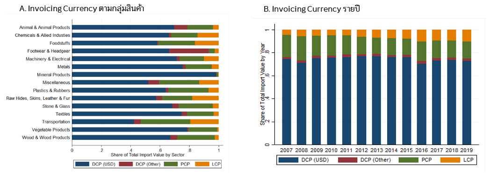
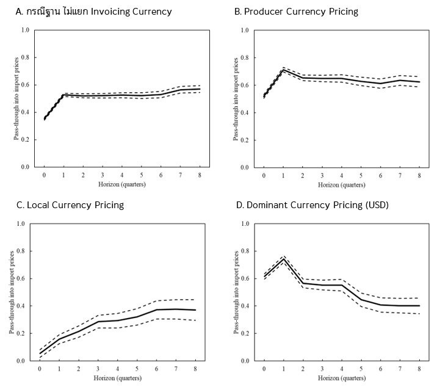
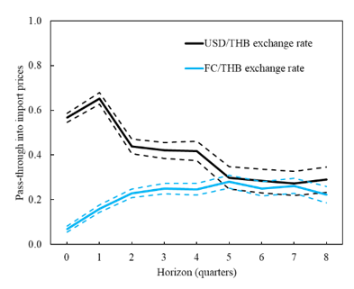
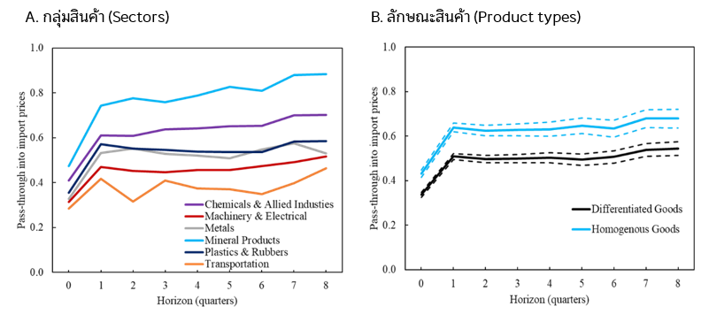
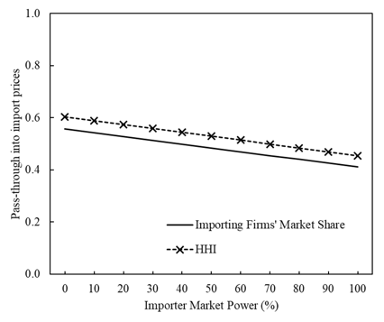
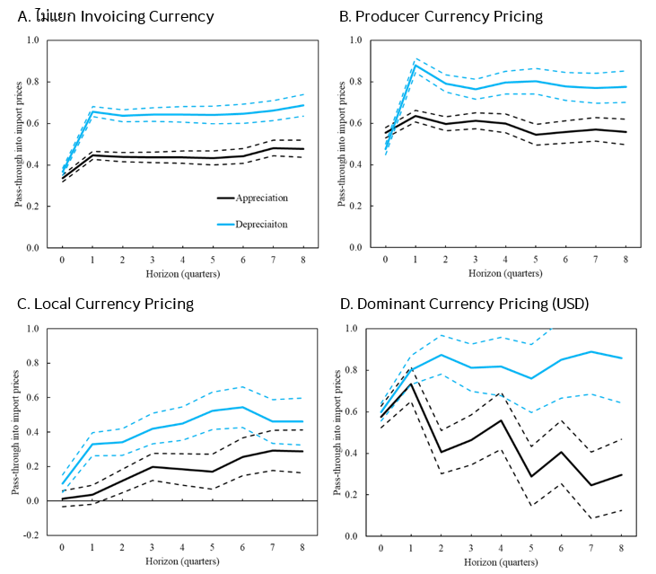

:::excerpt
บทความนี้ศึกษาการส่งผ่านของอัตราแลกเปลี่ยนไปยังราคาสินค้านำเข้าในประเทศไทย โดยอาศัยข้อมูลใบขนสินค้าขาเข้านับล้านรายการจากกรมศุลกากร จากการวิเคราะห์ข้อมูลที่มีความละเอียดสูงนี้ในหลายมิติพบว่า ผลกระทบของอัตราแลกเปลี่ยนต่อราคาสินค้านำเข้าสามารถขึ้นอยู่กับหลายปัจจัยที่มักถูกมองข้าม เช่น ประเภทสกุลเงินที่ใช้ในการตั้งราคาสินค้า ประเภทสินค้า อำนาจตลาดของผู้นำเข้าสินค้า รวมถึงทิศทางของอัตราแลกเปลี่ยน ข้อค้นพบเหล่านี้ช่วยเสริมองค์ความรู้เกี่ยวกับผลกระทบของอัตราแลกเปลี่ยนต่อภาคเศรษฐกิจไทย และนำไปสู่การประเมินความเสี่ยงต่อเงินเฟ้อที่มาจากการเปลี่ยนแปลงของอัตราแลกเปลี่ยนได้อย่างแม่นยำและรอบด้านยิ่งขึ้น 
:::

อัตราแลกเปลี่ยนเป็นปัจจัยสำคัญที่ส่งผลกระทบต่อเศรษฐกิจในวงกว้าง โดยเฉพาะสำหรับประเทศไทยที่มีความเชื่อมโยงกับต่างประเทศสูง อย่างไรก็ตาม หากกล่าวถึงผลกระทบของอัตราแลกเปลี่ยน เรามักจะนึกถึงภาคการส่งออกซึ่งถือเป็นเครื่องยนต์สำคัญของการเติบโตของเศรษฐกิจไทย แต่แท้ที่จริงแล้ว อัตราแลกเปลี่ยนมีบทบาทสำคัญต่อฝั่งการนำเข้าไม่แพ้กัน โดยเฉพาะอย่างยิ่ง ผลกระทบต่อราคาสินค้านำเข้าที่ท้ายสุดแล้วอาจส่งผ่านไปยังอัตราเงินเฟ้อโดยรวมของประเทศ ยกตัวอย่างเช่น ในกรณีที่เงินบาทอ่อนค่า ภาคธุรกิจอาจตัดสินใจปรับเพิ่มราคาสินค้าของตนเนื่องจากต้องรับภาระจากการนำเข้าวัตถุดิบหรือสินค้าในราคาที่สูงขึ้น ซึ่งท้ายที่สุดแล้วอาจนำไปสู่การเพิ่มขึ้นของอัตราเงินเฟ้อโดยรวมของประเทศ 

แต่ทั้งนี้เราคงปฏิเสธไม่ได้ว่า ผลกระทบจากการเปลี่ยนแปลงของค่าเงินที่มีต่อราคาสินค้าหรือวัตถุดิบนำเข้า หรือที่นักเศรษฐศาสตร์เรียกกันว่า exchange rate pass-through นั้น มักไม่ได้เป็นสัดส่วนเดียวกันสำหรับทุกรายการสินค้าอย่างถ้วนหน้าเสมอไป และคงมีหลายปัจจัย เช่น อำนาจตลาด (market power) ของผู้ประกอบการ หรือชนิดของสินค้า ที่อาจก่อให้เกิดความแตกต่างระหว่างขนาดของการส่งผ่านไปสู่ราคาสินค้านำเข้า ซึ่งหากผู้ดำเนินนโยบายไม่คำนึงถึงปัจจัยเหล่านี้ การประเมินผลกระทบของอัตราแลกเปลี่ยนต่อภาคเศรษฐกิจหรือการคาดการณ์เงินเฟ้อนั้นอาจคลาดเคลื่อนได้ ดังนั้น บทความนี้จึงมุ่งทำการศึกษาในเชิงลึกด้วยฐานข้อมูลใบขนสินค้าของกรมศุลกากรที่มีความละเอียดสูงเพื่อศึกษาปัจจัยสำคัญต่าง ๆ ที่อาจมีอิทธิพลต่อการส่งผ่านของอัตราแลกเปลี่ยนไปยังราคาสินค้านำเข้าในประเทศไทย

# เพราะเหตุใดจึงควรวิเคราะห์การส่งผ่านของอัตราแลกเปลี่ยนด้วยข้อมูลระดับจุลภาค?

งานศึกษาที่ใช้ข้อมูลในระดับมหภาคเพื่อศึกษาการส่งผ่านของอัตราแลกเปลี่ยนไปสู่ราคาสินค้าในหลาย ประเทศรวมทั้งไทยมักพบว่า ราคาสินค้าที่ผู้บริโภคกำลังเผชิญโดยเฉลี่ยเปลี่ยนแปลง**ค่อนข้างน้อย**เมื่อเกิดการเปลี่ยนแปลงของอัตราแลกเปลี่ยน (Ito and Sato, 2008; Forbes et al., 2017; Nookhwun, 2019) ซึ่งผู้ดำเนินนโยบายมักใช้ข้อค้นพบนี้เป็นหลัก (rule of thumb) ในการประเมินผลกระทบจากการเปลี่ยนแปลงของค่าเงินต่ออัตราเงินเฟ้อในประเทศสำหรับการตัดสินนโยบาย อย่างไรก็ตาม ผลกระทบของอัตราแลกเปลี่ยนต่อราคาสินค้านำเข้าในแต่ละรายการอาจมีขนาดหรือลักษณะที่แตกต่างกันออกไป ซึ่งรายละเอียดเหล่านี้มักถูกมองข้ามหรือบดบังไปด้วยการวิเคราะห์ข้อมูลในระดับมหภาค Apaitan et al. (2021) จึงใช้ประโยชน์จากข้อมูลในใบขนสินค้าขาเข้าของกรมศุลกากรเพื่อศึกษาการส่งผ่านของอัตราแลกเปลี่ยนไปยังราคาสินค้านำเข้า ซึ่งทำให้ค้นพบปัจจัยต่าง ๆ ที่สำคัญต่อการส่งผ่านของอัตราแลกเปลี่ยนที่โดยลำพังข้อมูลในระดับมหภาคนั้นไม่สามารถประเมินได้ โดยท้ายสุดแล้วองค์ความรู้ที่ได้จะช่วยให้ผู้ดำเนินนโยบายสามารถคาดการณ์และดูแลรักษาอัตราเงินเฟ้อให้อยู่ในระดับที่เหมาะสมได้ดียิ่งขึ้น อันเป็นผลดีต่อการรักษาเสถียรภาพของเศรษฐกิจไทยโดยรวม

Apaitan et al. (2021) ได้วิเคราะห์ข้อมูลการนำเข้าสินค้าในระดับใบขนของประเทศไทย ซึ่งเป็นข้อมูลรายไตรมาสตั้งแต่ปี 2007 ถึง 2019 ฐานข้อมูลนี้จะมีรายการนำเข้าทั้งสิ้นกว่า 1,633,316 รายการ โดยแต่ละรายการจะมีรายละเอียดระบุอยู่ในใบขนถึงประเทศต้นกำเนิด (country of origin) และประเทศผู้ส่งออก (exporting country) ซึ่งมีทั้งสิ้น 156 และ 28 ประเทศตามลำดับ[^1] อีกทั้งยังครอบคลุมประเภทสินค้าที่หลากหลาย โดยหากแบ่งตามรหัสพิกัดศุลกากร (Harmonized system code: HS code) ในระดับ 11 หลัก สินค้านำเข้าทั้งหมดสามารถจำแนกออกได้เป็น 11,624 ประเภท เช่น ในกรณีของประเภทกาแฟจะประกอบด้วย กาแฟที่ยังไม่คั่ว กาแฟที่คั่วแล้ว กาแฟที่ไม่มีคาเฟอีน และเปลือกกาแฟ เป็นต้น ซึ่งประเภทของสินค้าในฐานข้อมูลทั้งหมดสามารถแบ่งเป็น 15 กลุ่มสินค้าหลักตาม HS code ในระดับ 2 หลัก โดยกลุ่มสินค้าที่ประเทศไทยมีมูลค่าการนำเข้าสูงสุด 3 อันดับแรก ได้แก่ เครื่องจักรและอิเล็กทรอนิกส์ (Machinery and Electrical) ผลิตภัณฑ์จากแร่ (Mineral Products) และโลหะ (Metals) โดยมีสัดส่วนอยู่ที่ 31, 22 และ 13 เปอร์เซ็นต์ของมูลค่าการนำเข้าทั้งหมดของประเทศ ตามลำดับ

[^1]: บทความนี้พิจารณาเฉพาะประเทศผู้ส่งออกที่มีสัดส่วนสูงกว่า 1% ของมูลค่าการนำเข้าทั้งหมดของประเทศไทยในช่วงเวลาดังกล่าว

นอกจากนี้ รายละเอียดในแต่ละใบขนยังระบุถึงสกุลเงินที่ใช้ในการนำเข้า (invoicing currency) รวมถึงผู้นำเข้าที่มีทั้งสิ้นกว่า 23,199 ราย ซึ่ง 96% ของผู้ประกอบการเหล่านี้มีอำนาจตลาดค่อนข้างน้อย โดยหากแบ่งตลาดตาม HS code ของสินค้าในระดับ 6 หลักและประเทศผู้ส่งออกจะพบว่า สัดส่วนการนำเข้าของผู้ประกอบการรายหนึ่ง ๆ จากแต่ละตลาดส่วนใหญ่แล้วอยู่ในระดับต่ำกว่า 20% ซึ่งในทางทฤษฎีเศรษฐศาสตร์ ขนาดของการส่งผ่านของอัตราแลกเปลี่ยนไปยังราคาสินค้านำเข้าอาจขึ้นอยู่กับรายละเอียดในใบขนเหล่านี้เป็นสำคัญ ยกตัวอย่างเช่น หากสกุลเงินที่ใช้ในการตั้งราคาเป็นสกุลเงินท้องถิ่น ผู้ประกอบการควรได้รับผลกระทบจากการเปลี่ยนแปลงของค่าเงินน้อยกว่าในกรณีที่ราคาสินค้านั้นตั้งอยู่ในรูปสกุลเงินของผู้ผลิต เป็นต้น (Gillitzer and Moore, 2016; Gopinath et al., 2010; Chen et al., 2021) นอกจากนี้ การส่งผ่านของค่าเงินยังสามารถขึ้นอยู่กับอำนาจตลาดของผู้นำเข้าได้อีกด้วย โดยผู้นำเข้ารายใหญ่หรือผู้นำเข้าในตลาดที่มีการแข่งขันต่ำอาจได้รับผลกระทบจากการเปลี่ยนแปลงของอัตราแลกเปลี่ยนในระดับต่ำ เนื่องจากบริษัทเหล่านี้มักจะมีความยืดหยุ่นของอุปสงค์ต่อราคาสูง และสามารถต่อรองราคาได้เมื่อได้รับผลกระทบจากการเปลี่ยนแปลงของค่าเงิน (Devereux et al., 2017) 

อย่างไรก็ตาม งานศึกษาเชิงประจักษ์ที่ผ่านมายังขาดความชัดเจนว่าปัจจัยเหล่านี้สำคัญต่อการส่งผ่านของอัตราแลกเปลี่ยนจริงหรือไม่ และงานศึกษาส่วนใหญ่มักเน้นวิเคราะห์แต่ประสบการณ์ของประเทศที่พัฒนาแล้ว ดังนั้น Apaitan et al. (2021) จึงใช้ประโยชน์จากข้อมูลสินค้านำเข้าในระดับจุลภาคของไทยเพื่อเสนอมุมมองใหม่เกี่ยวกับปัจจัยต่าง ๆ ที่นักเศรษฐศาสตร์เล็งเห็นว่าสำคัญต่อการส่งผ่านของอัตราแลกเปลี่ยนมายังราคาสินค้านำเข้า โดยจากการวิเคราะห์อย่างรอบด้านด้วยข้อมูลที่มีความละเอียดสูงนี้ พบว่าปัจจัยที่สำคัญในกรณีของประเทศไทย ได้แก่ สกุลเงินที่ใช้ตั้งราคา ชนิดของสินค้าและอำนาจตลาดของผู้ประกอบการ รวมถึงทิศทางการเปลี่ยนแปลงของอัตราแลกเปลี่ยน ซึ่งสรุปสาระสำคัญได้ดังต่อไปนี้

## 1. สกุลเงินที่ใช้ในการตั้งราคาสินค้านำเข้า
ในการค้าระหว่างประเทศ Gopinath et al. (2020) พบว่า ราคาสินค้านำเข้าของหลายประเทศทั่วโลก มักถูกกำหนดอยู่ในรูปสกุลเงินใดสกุลเงินหนึ่งเป็นหลักซึ่งไม่ได้เป็นสกุลเงินของประเทศผู้ส่งออกและผู้นำเข้า โดยสกุลเงินหลักที่ใช้กันอย่างแพร่หลายคือสกุลเงินดอลลาร์ สรอ. (USD) โดยนักเศรษฐศาสตร์เรียกการตั้งราคาในลักษณะนี้ว่า Dominant Currency Pricing (DCP) สำหรับประเทศไทย Apaitan et al. (2021) **พบการตั้งราคาในรูปแบบ DCP เป็นส่วนใหญ่เช่นกัน** โดยสินค้านำเข้าที่ถูกตั้งราคาในรูป USD นั้นมีสัดส่วนสูงถึง 75% ของมูลค่าการนำเข้าสินค้าทั้งหมด[^2] แม้ว่ามูลค่าการนำเข้าสินค้าที่มีถิ่นกำเนิดจากสหรัฐฯ จะมีสัดส่วนเพียง 5% ส่วนสินค้านำเข้าที่เหลือถูกตั้งราคาอยู่ในรูปสกุลเงินของผู้ผลิต (Producer Currency Pricing: PCP) 16% และในรูปสกุลเงินท้องถิ่นของผู้นำเข้าหรือเงินบาทในกรณีของไทย (Local Currency Pricing: LCP) เพียง 8% ทั้งนี้ จากรูปที่ 1A จะเห็นได้ว่า DCP นั้นถูกใช้อย่างแพร่หลายในเกือบทุกกลุ่มสินค้ายกเว้นกลุ่มยานพาหนะ (Transportation) ซึ่งมีการใช้ PCP ในสัดส่วนที่ใกล้เคียงกัน นอกจากนี้ การใช้ DCP กันอย่างแพร่หลายในไทยนั้นยังเป็นรูปแบบการตั้งราคาสินค้านำเข้าที่ถูกใช้กันมาอย่างต่อเนื่อง แม้ว่าในระยะหลังอาจเห็นการตั้งราคาในรูปสกุลเงินบาทเพิ่มขึ้นมาบ้าง (รูปที่ 1B) ซึ่งอาจสืบเนื่องมาจากการส่งเสริมของธนาคารแห่งประเทศไทยให้ธุรกิจหันมาใช้สกุลเงินบาทในการค้าขายระหว่างประเทศเพื่อบริหารความเสี่ยงจากอัตราแลกเปลี่ยน

[^2]: ในกรณีของประเทศไทย การใช้ DCP ในสกุลเงินอื่นนอกจาก USD มีสัดส่วนที่น้อยประมาณ 2% ของมูลค่าสินค้านำเข้าทั้งหมด ซึ่งสกุลเงินที่เป็นที่นิยม 3 สกุล ได้แก่ สกุลเงินเยน ยูโร และ สิงคโปร์ดอลลาร์

<!-- fig -->

* **รูปที่ 1**: สัดส่วนมูลค่าการนำเข้าสินค้าตาม Invoicing Currency

 
* **หมายเหตุ**: DCP (USD) หมายถึงการตั้งราคาในรูปแบบ Dominant Currency Pricing โดยใช้สกุลเงิน USD ในขณะที่ DCP (Other) จะใช้สกุลเงินอื่นนอกเหนือจาก USD
* **ที่มา**: Apaitan et al. (2021) 

<!-- endfig -->

Apaitan et al. (2021) วิเคราะห์ให้เห็นว่า สกุลเงินที่ใช้ในการตั้งราคาสินค้านำเข้าสำคัญยิ่งต่อขนาดและลักษณะการส่งผ่านของอัตราแลกเปลี่ยน โดยเปรียบเทียบความแตกต่างของการส่งผ่านของอัตราแลกเปลี่ยนในกรณีฐาน (baseline) ซึ่งไม่คำนึงถึงผลของสกุลเงินที่ใช้กำหนดราคาสินค้านำเข้ากับกรณีการตั้งราคาสินค้าในลักษณะ PCP, LCP และ DCP รูปที่ 2A แสดงผลการศึกษาในกรณีฐานโดยแกนตั้งแสดงอัตราการส่งผ่านผลกระทบมายังราคาสินค้านำเข้า (0 คือไม่มีผลกระทบ ไปจนถึง 1 คือส่งผ่านผลกระทบโดยสมบูรณ์) ขณะที่แกนนอนแสดงระยะเวลาหลังจากที่เกิดการเปลี่ยนแปลงของค่าเงิน และพบว่าโดยเฉลี่ยแล้ว หากอัตราแลกเปลี่ยนบาทต่อสกุลเงินของผู้ส่งออก (FCTHB) เปลี่ยนแปลง 1% จะนำไปสู่การปรับราคาสินค้านำเข้าในรูปเงินบาทถึง 0.6% ภายในระยะเวลา 1 ไตรมาส โดยขนาดของการส่งผ่านนี้ถือว่ามีขนาดที่ใหญ่พอกับผลของงานศึกษาในต่างประเทศ (Campa et al., 2005; Gopinath and Rigobon, 2008; Giuliano and Luttini, 2020; Ortega and Osbat, 2020; Chen et al., 2021) เป็นการส่งผ่านในลักษณะที่เรียกว่า**ไม่สมบูรณ์ (incomplete)** และ**รวดเร็ว (immediate)** เนื่องจากการส่งผ่านส่วนใหญ่เกิดขึ้นทันทีในระยะสั้น ขณะที่ผลในระยะปานกลางหรือ 8 ไตรมาสไม่แตกต่างจากผลในระยะสั้นมากนัก

<!-- fig -->

* **รูปที่ 2**: การส่งผ่านของอัตราแลกเปลี่ยนไปยังราคาสินค้านำเข้าตาม Invoicing Currency

 
* **หมายเหตุ**: เส้นทึบแสดงผลรวมของการส่งผ่านของอัตราแลกเปลี่ยนไปยังราคาสินค้านำเข้าในแต่ละไตรมาส และเส้นประแสดง 95% confidence bands
* **ที่มา**: Apaitan et al. (2021) 

<!-- endfig -->

อย่างไรก็ตาม หากจำแนกผลการส่งผ่านของอัตราแลกเปลี่ยนตามประเภทของสกุลเงินที่ใช้ในการตั้งราคาสินค้า รูปที่ 2B-2D แสดงให้เห็นว่า เมื่อคำนึงถึงสกุลเงินที่ใช้ในการตั้งราคาสินค้า ขนาดและพลวัตของการส่งผ่านมีความแตกต่างจากกรณีฐานอย่างเห็นได้ชัด โดยข้อสังเกตที่น่าสนใจประการแรกคือ ในกรณีที่ราคาสินค้านำเข้าอยู่ในรูปสกุลเงินต่างประเทศ ไม่ว่าจะเป็นสกุลเงินของผู้ส่งออก (PCP) หรือในรูปสกุลเงินหลัก (DCP) ที่เป็นเงินดอลลาร์ สรอ. การเปลี่ยนแปลงของค่าเงินจะส่งผลกระทบต่อราคาสินค้านำเข้ามากกว่าเมื่อเทียบกับกรณีที่ราคาสินค้าอยู่ในรูปเงินบาท (LCP) ซึ่งในกรณี LCP การส่งผ่านของอัตราแลกเปลี่ยนในระยะสั้นมีค่าที่น้อยมากใกล้ศูนย์ แต่ใน**กรณี PCP และ DCP นั้นกลับพบอัตราการส่งผ่านที่สูง** กล่าวคือหากเงินบาทอ่อนค่าลง 1% จะทำให้ราคาสินค้านำเข้าสูงขึ้นถึง 0.7% ซึ่งหมายความว่าผู้ประกอบการของไทยที่นำเข้าสินค้าในรูปสกุลเงินต่างประเทศต้องรองรับความเสี่ยงจากความผันผวนของค่าเงินเป็นหลัก แต่หากนำเข้าสินค้าในรูปเงินบาท อาจไม่ต้องเผชิญกับความเสี่ยงนี้ อย่างไรก็ตาม การที่อัตราการส่งผ่านในกรณี LCP ทยอยเพิ่มขึ้นเป็นลำดับจนมาอยู่ที่ระดับ 0.4 ในระยะปานกลางนั้นแสดงให้เห็นว่าผู้นำเข้าไทยกลุ่มนี้ก็ยังได้รับผลกระทบจากอัตราแลกเปลี่ยนบ้างเช่นกัน

<!-- fig -->

* **รูปที่ 3**: การส่งผ่านของอัตราแลกเปลี่ยนไปถึงราคาสินค้านำเข้ากรณี Dominant Currency Pricing (USD)

 
* **หมายเหตุ**: เส้นทึบแสดงผลรวมของการส่งผ่านของอัตราแลกเปลี่ยนไปยังราคาสินค้านำเข้าในแต่ละไตรมาส และเส้นประแสดง 95% confidence bands โดยสีดำแสดงการส่งผ่านของค่าเงินบาทเทียบดอลลาร์ สรอ. (USDTHB) และสีฟ้าแสดงการส่งผ่านของค่าเงินบาทเทียบสกุลเงินของผู้ส่งออก (FCTHB)
* **ที่มา**: Apaitan et al. (2021) 

<!-- endfig -->

ในเมื่อสกุลเงินที่ใช้ในการตั้งราคาสินค้านั้นมีความสำคัญต่อการประเมินขนาดการส่งผ่านของอัตราแลกเปลี่ยน คำถามเชิงนโยบายสำคัญที่ตามมาคือ ในกรณีของไทยที่มีการใช้ DCP กันอย่างแพร่หลายโดยเฉพาะในรูปสกุลเงินดอลลาร์ สรอ. ผู้ดำเนินนโยบายควรให้ความสำคัญกับอัตราแลกเปลี่ยนบาทเทียบกับสกุลเงินของผู้ส่งออก (FCTHB) หรืออัตราแลกเปลี่ยนบาทต่อดอลลาร์ สรอ. (USDTHB) ในการประเมินความเสี่ยงต่อราคาสินค้าจากการเปลี่ยนแปลงของอัตราแลกเปลี่ยน รูปที่ 3 เปรียบเทียบขนาดการส่งผ่านของอัตราแลกเปลี่ยนทั้งสองต่อราคาสินค้านำเข้าที่ถูกกำหนดอยู่ในรูปสกุลเงินดอลลาร์ สรอ. ดังกล่าว และพบว่า การเปลี่ยนแปลงของ USDTHB (เส้นสีดำ) มีอัตราการส่งผ่านที่สูงกว่า FCTHB (เส้นสีฟ้า) อยู่มากในระยะสั้น ซึ่งสะท้อนว่าผู้ดำเนินนโยบายควรให้ความสำคัญกับการเคลื่อนไหวของ USDTHB เป็นหลักในการประเมินผลของการเปลี่ยนแปลงของค่าเงินที่มีต่อราคาสินค้านำเข้าตลอดจนแรงกดดันเงินเฟ้อในประเทศ อย่างไรก็ดี ในระยะปานกลาง ค่าเงิน FCTHB มีความสำคัญมากขึ้น เนื่องจากการเคลื่อนไหวของอัตราแลกเปลี่ยนทั้งสองส่งผลต่อราคาสินค้านำเข้าไทยในขนาดใกล้เคียงกัน ซึ่งการที่ FCTHB ส่งผลต่อราคาสินค้านำเข้าแม้ว่าสินค้านั้นจะถูกกำหนดราคาในรูปสกุลเงินดอลลาร์ สรอ. อาจเป็นการบ่งชี้ว่า ผู้ส่งออกต้องมีการเจรจาปรับราคาสินค้าเพื่อตอบสนองต่อการเปลี่ยนแปลงของต้นทุนการผลิตและอัตรากำไรอันเป็นผลจากการเคลื่อนไหวของสกุลเงินของตนเองด้วย ซึ่งผลที่ได้สอดคล้องกับประสบการณ์ของประเทศชิลีในงานศึกษาของ Giuliano and Luttini (2021) ที่พบว่าสำหรับกรณี DCP อัตราแลกเปลี่ยนระหว่างสกุลเงินของผู้ส่งออกและตนเองมีความสำคัญในระยะปานกลางเช่นกัน

## 2. ลักษณะของสินค้านำเข้าและอำนาจตลาดของผู้ประกอบการ
การส่งผ่านของอัตราแลกเปลี่ยนมายังราคาสินค้านำเข้ามีความแตกต่างกันมากในแต่ละกลุ่มสินค้า โดยหากพิจารณาขนาดของการส่งผ่านในกลุ่มสินค้านำเข้า 6 กลุ่มที่มีมูลค่าการนำเข้าสูงสุดดังแสดงในรูปที่ 4A จะเห็นได้ว่า กลุ่ม Mineral Products มีการส่งผ่านสูงที่สุด กล่าวคือ การเปลี่ยนแปลงของอัตราแลกเปลี่ยน 1% จะนำไปสู่การปรับราคาในรูปเงินบาทในขนาดที่ใหญ่เกินกว่า 0.8% ในระยะปานกลาง เช่นเดียวกับสินค้าในกลุ่มเคมีและผลิตภัณฑ์ที่เกี่ยวข้อง (Chemical & Allied Industries) ที่พบอัตราการส่งผ่านที่สูงเป็นอันดับสองรองลงมาที่ระดับ 0.6 ในขณะที่ราคาสินค้านำเข้าในกลุ่ม Transportation และ Machinery & Electrical ตอบสนองต่อการเปลี่ยนแปลงของอัตราแลกเปลี่ยนค่อนข้างน้อย (ประมาณ 0.4)

Apaitan et al. (2021) ตั้งข้อสังเกตว่า ผลการส่งผ่านของอัตราแลกเปลี่ยนที่แตกต่างในแต่ละกลุ่มสินค้านั้นอาจขึ้นอยู่กับลักษณะของสินค้าเป็นสำคัญ เพราะหากใช้นิยามของ Rauch (1999) จำแนกลักษณะสินค้านำเข้าออกเป็นสองแบบ ได้แก่ สินค้าที่มีลักษณะคล้ายคลึงกัน (homogenous goods) ซึ่งมีการซื้อขายในตลาดที่เป็นทางการ (organized exchange) หรือมีราคาอ้างอิงในตลาดโลก กับสินค้าที่มีลักษณะแตกต่างกัน (differentiated goods) พบว่า กลุ่มสินค้าที่มีขนาดการส่งผ่านของอัตราแลกเปลี่ยนสูง ได้แก่ Mineral Products และ Chemical & Allied Industries ล้วนเป็นกลุ่มสินค้าที่มีสัดส่วนของ homogenous goods สูงด้วยเช่นกัน (99% และ 55% ตามลำดับ) ในทางกลับกัน กลุ่มสินค้าที่มีขนาดการส่งผ่านของอัตราแลกเปลี่ยนต่ำ ได้แก่ Transportation และ Machinery & Electrical ต่างมีองค์ประกอบเป็นสินค้าประเภท differentiated goods ทั้งสิ้น ซึ่งข้อสมมติฐานนี้สอดคล้องกับผลที่แสดงในรูปที่ 4B ที่แสดงให้เห็นว่า ราคาสินค้านำเข้าประเภท homogenous goods มีความอ่อนไหวต่อการเปลี่ยนแปลงของอัตราแลกเปลี่ยนมากกว่า differentiated goods ทั้งในระยะสั้นและระยะยาว ดังนั้น ลักษณะของสินค้าจึงเป็นปัจจัยหนึ่งที่สามารถช่วยอธิบายความแตกต่างในการส่งผ่านของอัตราแลกเปลี่ยนที่เกิดขึ้นในแต่ละกลุ่มสินค้าได้

<!-- fig -->

* **รูปที่ 4**: การส่งผ่านของอัตราแลกเปลี่ยนไปยังราคาสินค้านำเข้าตามกลุ่มสินค้าและลักษณะสินค้านำเข้า

 
* **หมายเหตุ**: เส้นทึบแสดงผลรวมของการส่งผ่านของอัตราแลกเปลี่ยนไปยังราคาสินค้านำเข้า และเส้นประแสดง 95% confidence bands
* **ที่มา**: Apaitan et al. (2021) 

<!-- endfig -->

ขนาดการส่งผ่านของอัตราแลกเปลี่ยนไปยังราคาสินค้านำเข้าประเภท homogenous goods ซึ่งอยู่ในระดับสูงนั้นอาจสะท้อนถึงบทบาทสำคัญของอำนาจต่อรองของผู้ประกอบการ เนื่องจากราคาสินค้าประเภทนี้มักอ่อนไหวไปตามปัจจัยในตลาดโลก ส่งผลให้ผู้นำเข้ามีอำนาจในการต่อรองราคาต่ำและต้องเผชิญกับผลกระทบจากการเปลี่ยนแปลงของอัตราแลกเปลี่ยนในระดับที่สูงกว่าผู้นำเข้าสินค้าประเภทอื่น ดังนั้น เพื่อศึกษาประเด็นนี้ในเชิงลึก Apaitan et al. (2021) จึงคำนวณ 2 ดัชนีชี้วัด ได้แก่ (1) สัดส่วนของมูลค่าการนำเข้าของผู้ประกอบการในแต่ละตลาดส่งออก (importer’s market share) และ (2) ดัชนีชี้วัดระดับการผูกขาด Herfindahl-Hirschman index (HHI) เพื่อใช้สะท้อนอำนาจตลาดของผู้นำเข้าและระดับของการแข่งขันในตลาด และศึกษาว่าผู้นำเข้าที่มีอำนาจตลาดในระดับต่ำต้องรองรับผลกระทบจากการส่งผ่านของอัตราแลกเปลี่ยนในระดับที่สูงกว่าจริงหรือไม่ จากผลการศึกษาในรูปที่ 5 แสดงให้เห็นว่า อำนาจตลาดของผู้นำเข้าที่วัดผ่านทั้งสองดัชนีข้างต้นมีความสัมพันธ์ในเชิงลบต่อขนาดการส่งผ่านของค่าเงินอย่างชัดเจน กล่าวคือ หากผู้นำเข้ามีอำนาจทางตลาดมากขึ้น จะส่งผลให้ขนาดการส่งผ่านของอัตราแลกเปลี่ยนลดลง โดยในตลาดที่มีผู้ขายมากราย อัตราการส่งผ่านของค่าเงินจะสูงกว่าประมาณ 0.15 เมื่อเทียบกับตลาดที่มีผู้นำเข้าผูกขาดเพียงรายเดียว ดังนั้น อำนาจตลาดของผู้นำเข้าจึงเป็นอีกปัจจัยสำคัญที่ส่งผลกระทบต่อการส่งผ่านของค่าเงิน[^3]

[^3]: ผลการศึกษานี้สอดคล้องกับข้อสรุปของ Devereux et al. (2017) ซึ่งเป็นงานศึกษาอีกชิ้นหนึ่งที่ใช้ประโยชน์จากข้อมูลในระดับสินค้าเพื่อศึกษาการส่งผ่านของค่าเงินต่อราคาสินค้านำเข้า และพบความแตกต่างของการส่งผ่านตามอำนาจตลาดของผู้ประกอบการ ทั้งนี้ งานศึกษาอื่น ๆ ในอดีตมักให้ความสำคัญกับอำนาจตลาดในฝั่งผู้ส่งออกเป็นหลัก (Devereux et al., 2017; Auer and Schoenle, 2016) โดยมักพบว่า การส่งผ่านของอัตราแลกเปลี่ยนจะมีความสัมพันธ์ในลักษณะ U-shaped กับอำนาจตลาดของผู้ส่งออก กล่าวคือผู้ส่งออกที่มีขนาดเล็กและใหญ่มากมักจะไม่ต้องสนใจผลกระทบของการปรับราคาสินค้าของตนต่อปริมาณการนำเข้า ดังนั้นจึงส่งผ่านผลของการเปลี่ยนแปลงของค่าเงินไปยังราคาสินค้าได้ค่อนข้างมาก

<!-- fig -->

* **รูปที่ 5**: การส่งผ่านของอัตราแลกเปลี่ยนไปยังราคาสินค้านำเข้าตามระดับอำนาจตลาดของผู้นำเข้า

 
* **หมายเหตุ**: แกนตั้งแสดงผลรวมของการส่งผ่านของอัตราแลกเปลี่ยนไปยังราคาสินค้านำเข้าในระยะปานกลาง (8 ไตรมาส) และแกนนอนแสดงระดับอำนาจตลาดของผู้นำเข้าโดยวัดผ่าน 2 ดัชนีชี้วัด
* **ที่มา**: Apaitan et al. (2021) 

<!-- endfig -->

## 3. ทิศทางการเปลี่ยนแปลงของอัตราแลกเปลี่ยน
นักเศรษฐศาสตร์จำนวนหนึ่งสันนิษฐานว่า การส่งผ่านของอัตราแลกเปลี่ยนน่าจะขึ้นอยู่กับทิศทางการเปลี่ยนแปลงของอัตราแลกเปลี่ยน อย่างไรก็ตาม ผลเชิงประจักษ์จากงานวิจัยที่ผ่านมายังไม่มีข้อสรุปที่แน่ชัดว่าการแข็งค่าหรืออ่อนค่าของค่าเงินในทิศทางใดส่งผลกระทบต่อราคาสินค้ามากกว่ากัน (Delatte and Lopez-Villavicencio, 2012; Bussiere, 2013; El bejaoui, 2013) ในกรณีของไทย Apaitan et al. (2021) พบว่า การอ่อนค่าของเงินบาทส่งผลให้ราคาสินค้านำเข้าปรับเพิ่มขึ้นในขนาดที่มากกว่าการลดลงของราคาสินค้านำเข้าในกรณีที่เงินบาทแข็งค่าขึ้น ไม่ว่าราคาสินค้านำเข้านั้นจะถูกกำหนดอยู่ในรูปสกุลเงินบาทหรือสกุลเงินต่างประเทศ (รูปที่ 6A-6D) ซึ่งผลการศึกษานี้สอดคล้องกับทฤษฎี Downward nominal price rigidity ของราคาสินค้าส่งออกที่อธิบายว่า เมื่อสกุลเงินของผู้นำเข้าอ่อนค่าลง แม้ผู้ส่งออกจะต้องสูญเสียความสามารถในการแข่งขัน แต่ผู้ส่งออกอาจลังเลที่จะปรับลดราคาสินค้าของตนลง จึงทำให้ผลของการเปลี่ยนแปลงของค่าเงินถูกส่งต่อมายังราคาสินค้านำเข้าในระดับที่สูง[^4] นอกจากนี้ หากอำนาจตลาดของผู้นำเข้าอยู่ในระดับที่ค่อนข้างต่ำเช่นในกรณีของประเทศไทย ผู้ส่งออกอาจสามารถส่งผ่านผลของการอ่อนค่าของค่าเงินไปสู่การเพิ่มขึ้นของราคาสินค้านำเข้าได้โดยไม่จำเป็นต้องลดอัตรากำไร (profit margin) ของตนลง (Delatte and Lopez-Villavicencio, 2012)

[^4]: ในทางกลับกัน ในกรณีที่สกุลเงินของผู้นำเข้าแข็งค่าขึ้น ผู้ส่งออกอาจพิจารณาปรับขึ้นราคาสินค้าของตนเพื่อเพิ่มอัตรากำไร ส่งผลให้การส่งผ่านของอัตราแลกเปลี่ยนไปยังราคาสินค้านำเข้าลดลง

<!-- fig -->

* **รูปที่ 6**: การส่งผ่านของอัตราแลกเปลี่ยนไปยังราคาสินค้านำเข้าตามทิศทางของอัตราแลกเปลี่ยน

 
* **หมายเหตุ**: เส้นทึบแสดงผลรวมของการส่งผ่านของอัตราแลกเปลี่ยนไปสู่ราคาสินค้านำเข้า และเส้นประแสดง 95% confidence bands
* **ที่มา**: Apaitan et al. (2021) 

<!-- endfig -->

ทั้งนี้ ความแตกต่างในการส่งผ่านของอัตราแลกเปลี่ยนอันเป็นผลจากทิศทางการเคลื่อนไหวของค่าเงินจะเห็นได้ชัดเจนที่สุดในกรณีของ DCP ซึ่งอาจสะท้อนถึงอำนาจต่อรองที่มีอยู่จำกัดของผู้นำเข้าที่ใช้สกุลเงินดอลลาร์ สรอ. ในการตั้งราคาสินค้า กล่าวคือ เมื่อเงินบาทอ่อนค่า ราคาสินค้านำเข้าในรูปสกุลเงินบาทจะปรับเพิ่มขึ้นจนเรียกได้ว่ามีการส่งผ่านที่สมบูรณ์ในระยะยาว (complete pass-through) ซึ่งการที่ผู้นำเข้าต้องเผชิญกับราคาสินค้านำเข้าที่สูงขึ้นทั้งในระยะสั้นและระยะยาวเมื่อเงินบาทอ่อนค่านั้นอาจเป็นเพราะไม่สามารถต่อรองให้ผู้ส่งออกปรับลดราคาลงได้ ส่วนในกรณีที่เงินบาทแข็งค่าขึ้น แม้ผู้นำเข้าจะได้รับประโยชน์ในระยะสั้นจากราคาสินค้านำเข้าที่ถูกลง แต่ในระยะยาวผู้นำเข้าอาจต้องยอมรับการปรับขึ้นราคาสินค้าของผู้ส่งออกเนื่องจากขาดอำนาจในการต่อรอง ทำให้อัตราการส่งผ่านทยอยลดลงจาก 0.6 ไปอยู่ที่ใกล้ระดับ 0.2 จากผลการศึกษาทั้งหมดนี้จะเห็นได้ว่าความไม่สมมาตรในการส่งผ่านของอัตราแลกเปลี่ยนจึงควรเป็นอีกประเด็นหนึ่งที่ธนาคารกลางและภาครัฐต้องให้ความสำคัญ เนื่องจากมีนัยต่อทั้งกำไรของผู้นำเข้า ตลอดจนการประเมินแรงกดดันเงินเฟ้อในระดับประเทศ

# ข้อสรุปและนัยเชิงนโยบาย

งานศึกษานี้เน้นให้เห็นว่า การประเมินผลกระทบของอัตราแลกเปลี่ยนต่อราคาสินค้านำเข้าและอัตราเงินเฟ้อของประเทศนั้นไม่ควรจำกัดอยู่ที่ระดับมหภาคหรือผลในภาพรวมเพียงอย่างเดียว เนื่องจากผลการศึกษาเชิงประจักษ์ในระดับจุลภาคได้ชี้ให้เห็นว่า การส่งผ่านของอัตราแลกเปลี่ยนนั้นมีความแตกต่างกันอย่างเห็นได้ชัดตามประเภทสกุลเงินที่ใช้ในการตั้งราคาสินค้า ประเภทของสินค้า อำนาจตลาดของผู้ประกอบการ รวมไปถึงทิศทางการเปลี่ยนแปลงของอัตราแลกเปลี่ยน โดยข้อค้นพบหลักในงานศึกษานี้มีนัยเชิงนโยบายที่สำคัญ 3 ข้อ ได้แก่ 

1. เนื่องจากสินค้านำเข้าส่วนใหญ่ในประเทศไทยมีการตั้งราคาในรูปสกุลเงินดอลลาร์ สรอ. ในการประเมินผลกระทบของอัตราแลกเปลี่ยนต่อราคาสินค้านำเข้าหรืออัตราเงินเฟ้อ ผู้กำหนดนโยบายควรติดตามผลกระทบของอัตราแลกเปลี่ยนโดยใช้ดัชนีค่าเงินที่ให้น้ำหนักตามสกุลเงินที่ใช้ในการตั้งราคาสินค้านำเข้า (invoicing currency weights) เพิ่มเติมจากการติดตามผ่านดัชนีค่าเงินที่อ้างอิงตามสัดส่วนการส่งออกและนำเข้าของประเทศคู่ค้า (trade weights) โดยเฉพาะในระยะสั้นที่ราคาสินค้านำเข้าข้างต้นอ่อนไหวกับอัตราแลกเปลี่ยนบาทต่อดอลลาร์ สรอ. มากกว่าบาทต่อสกุลเงินของผู้ส่งออก
2. ในการบริหารความเสี่ยงจากอัตราแลกเปลี่ยน นอกเหนือจากการส่งเสริมให้ผู้ประกอบการใช้เครื่องมือบริหารความเสี่ยงด้านอัตราแลกเปลี่ยนมากขึ้นแล้ว ผู้ดำเนินนโยบายยังสามารถสนับสนุนให้ผู้นำเข้าตั้งราคาสินค้าอยู่ในรูปสกุลเงินท้องถิ่นมากขึ้น เนื่องจากการส่งผ่านของอัตราแลกเปลี่ยนมายังราคาสินค้านำเข้าที่กำหนดในรูปเงินบาทอยู่ในระดับที่ต่ำกว่าการตั้งราคาในรูปสกุลเงินต่างประเทศ
3. ผู้ดำเนินนโยบายควรหลีกเลี่ยงการใช้ rule of thumb ในการประเมินผลกระทบของอัตราแลกเปลี่ยนต่อเศรษฐกิจและเงินเฟ้อในแต่ละภาคส่วน เนื่องจากขนาดการส่งผ่านของอัตราแลกเปลี่ยนมีความแตกต่างกันตามกลุ่มสินค้า ประเภทของสินค้านำเข้า รวมถึงอำนาจตลาดของผู้ประกอบการ นอกจากนี้ ผลการศึกษาที่บ่งชี้ว่าการส่งผ่านของอัตราแลกเปลี่ยนในด้านอ่อนค่ามีระดับที่สูงกว่าด้านแข็งค่านั้น มีนัยยะสำคัญต่อการดำเนินนโยบายที่ควรต้องมีการติดตามพัฒนาการความเสี่ยงต่อเงินเฟ้อเมื่อเงินบาทอ่อนค่ามากยิ่งขึ้น รวมถึงต้นทุน (trade-off) ที่อาจเกิดกับผู้นำเข้า ยกตัวอย่างเช่น ถึงแม้ว่าภาคส่งออกอาจได้รับประโยชน์จากการอ่อนค่าของอัตราแลกเปลี่ยน แต่ผลที่เกิดขึ้นตามมาคือผู้ประกอบการในฝั่งนำเข้าที่ต้องเผชิญกับต้นทุนที่สูงขึ้นมากจนอาจส่งผ่านต้นทุนนั้นมายังราคาสินค้าของผู้บริโภค ซึ่งย่อมส่งผลกระทบต่ออัตราเงินเฟ้อโดยรวมของประเทศและการดูแลเสถียรภาพทางด้านราคาของธนาคารกลางต่อไป

# เอกสารอ้างอิง

Apaitan, T., P. Manopimoke, N. Nookhwun, J. Pattararangrong (2021) Exchange rate pass-through to import prices in Thailand: Evidence from micro data. PIER Discussion Paper, Issue 167.

Auer, R. and Schoenle, R. (2016). Market structure and exchange rate pass-through. Journal of International Economics, 98:60–77.

Bussiere,  M.  (2013). Exchange  rate  pass-through  to  trade  prices: The role of nonlinearities  and asymmetries. Oxford Bulletin of Economics and Statistics, 75(5):731–758.

Campa, J. M., Goldberg, L. S., and Gonz´alez-M´ınguez, J. M. (2005). Exchange-rate pass-through to import prices in the euro area. Working Paper 11632, National Bureau of Economic Research.

Chen, N., Chung, W., and Novy, D. (2021). Vehicle currency pricing and exchange rate pass-through. Journal of the European Economic Association.  

Delatte, A.-L. and L ́opez-Villavicencio, A. (2012). Asymmetric exchange rate pass-through:  Evidence from major countries. Journal of Macroeconomics, 34(3):833–844.

Devereux,  M. B., Dong, W., and Tomlin, B. (2017). Importers and exporters in exchange rate pass-through and currency invoicing. Journal of International Economics, 105:187–204.

El bejaoui, H. J. (2013). Asymmetric effects of exchange rate variations: An empirical analysis for four advanced countries. International Economics, 135-136:29–46.

Forbes, K., Hjortsoe, I., and Nenova, T. (2017). Shocks versus structure: Explaining differences in exchange rate pass-through across countries and time. Discussion Papers 50, Monetary Policy Committee Unit, Bank of England.

Gillitzer, C. and Moore, A. (2016). Trade invoicing currency and first-stage exchange rate pass-through. RBA Research Discussion Papers, Reserve Bank of Australia.

Giuliano, F. and Luttini, E. (2020). Import prices and invoice currency: Evidence from Chile. Journal of International Money and Finance, 106.

Gopinath, G. (2015). The international price system. Working Paper 21646, National Bureau of Economic Research.
